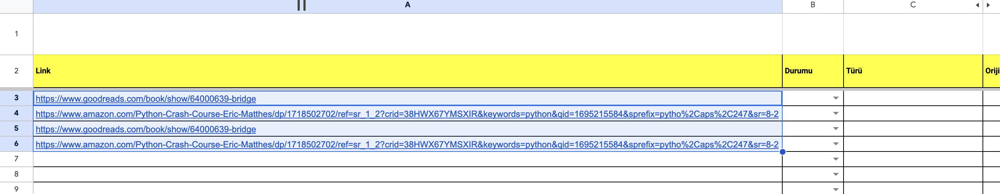
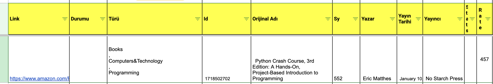

# Google Sheets and Amazon and Goodreads Data Scraping

### Introduction

This Python script is designed to interact with Google Sheets and retrieve book data from Amazon and goodreads. It processes the data and updates a Google Sheets document with the results.  

### Prerequisites
Before running the script, make sure you have the following:

- Python installed on your system.

- Necessary Python packages installed. You can install them using the following command:

- **keys.json:** A JSON file containing the credentials for your Google API service account.

### Usage

First of all, on the google sheets page we will use, you can write both your amazon link and googreads link on this page between A3 and C3, the code automatically separates the links. In addition, if there is any text for the relevant link in the C coluon there is ranks information for my example, the bot dont scraping for  relevant link.

### Customization
You can modify the range **(range='Kategori İnceleme!A3:C100000')** to target specific cells in your Google Sheet.
Additional functionality can be integrated by modifying the **anakazimaalgo** and **amazonSc** functions.

### Scraped Datas

The following information is retrieved when scraping for book information on amazon:

- Ranks
- ISBN-10
- Name of book
- Number of page
- Author
- Publisher
- Publication date
- Rate
- Number of rewies

The following information is retrieved when scraping for book information on Goodreads:

- Ranks
- ISBN-10
- Name of book
- Number of page
- Author
- Publisher
- Publication date
- Rate
- Number of rewies
- Stats

Please remember to replace your_script_name.py with the actual name of your Python script. If you have any further questions or need additional assistance, feel free to ask!

